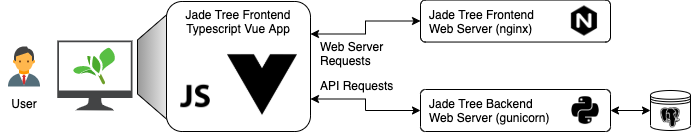
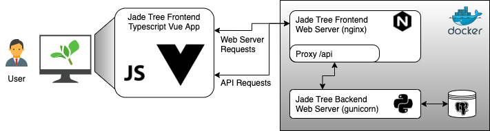
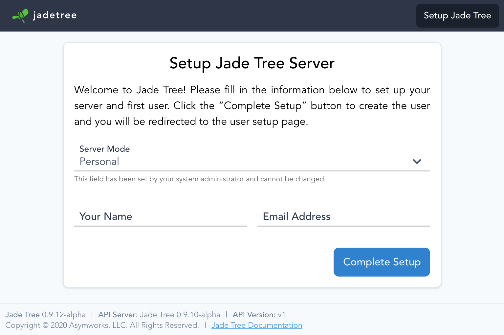

# Installing Jade Tree

Follow the instructions below to install Jade Tree with Docker and set up your
database and Jade Tree installation.

:::details Getting Docker
The easiest way to get all three parts up and running together is to use
[Docker](https://docker.com/get-started). Follow the instructions there to
download and run Docker Desktop. If you already have a Docker installation,
you are free to use it as well.
:::

:::warning
Currently Docker is the only officially supported installation mechanism,
although from inspection of the individual Dockerfiles it should be
straightforward to set up and run directly on a server. When reporting bugs,
please ensure they are reproducible on a Docker host set up per the below or
your bug report may not be accepted.
:::

## Overview

The Jade Tree application comprises three parts: a frontend web interface which
is accessed via a web browser, a backend API server, and a database which holds
all budgeting and user data. The diagram below shows how the pieces fit together
and communicate.



The default Docker Compose setup modifies this slightly by using the frontend
web server to proxy `/api/` URLs directly to the backend server so that all
browser to Jade Tree traffic goes to a single Docker container. This can be
overridden in the frontend configuration.



## Install with Docker Compose

Jade Tree ships with a sample `docker-compose.yml` file to get up and running
fast. Clone the Jade Tree Backend [GitHub Repository](https://github.com/asymworks/jadetree-backend)
and run the following commands. This will set up three containers for the
PostgreSQL database, Jade Tree backend, and Jade Tree frontend.

:::warning
The database initialization command is important and is not currently automated
for new Jade Tree installations. If you do not run it, the Jade Tree frontend
will display an error. Note the backend must be restarted after initializing
the database.
:::

```sh
$ git clone https://github.com/asymworks/jadetree-backend.git jadetree
$ docker-compose -f jadetree/docker-compose.yml up -d
$ docker-compose -f jadetree/docker-compose.yml exec backend /home/jadetree/docker-entry.sh db init
$ docker-compose -f jadetree/docker-compose.yml restart backend
```

The Jade Tree frontend can now be accessed at [http://127.0.0.1:8733](http://127.0.0.1:8733)
and is ready to proceed with server setup.

## Install with Individual Containers

Jade Tree requires two Docker containers to be configured: the backend API
server and the frontend web server. Optionally a third container may be added
to host a database.

### Backend API Server

The [`asymworks/jadetree-backend`](https://hub.docker.com/r/asymworks/jadetree-backend)
Docker image provides the Jade Tree API. The API server supports many
configuration variables which may be set with a configuration file mounted into
the container, or by environment variables. Note that environment variables,
when set, will override any values provided in a configuration file.

```sh
$ docker run --rm \
    --env JADETREE_DB_DRIVER=sqlite \
    --env JADETREE_DB_FILE=/jadetee.db \
    --volume ./jadetree.db:/jadetree.db \
    asymworks:jadetree-backend:0.9-alpha \
    db init

$ docker start \
    --env JADETREE_DB_DRIVER=sqlite \
    --env JADETREE_DB_FILE=/jadetee.db \
    --volume ./jadetree.db:/jadetree.db \
    --publish 5000:5000 \
    asymworks:jadetree-backend:0.9-alpha
```

Jade Tree settings can also be placed in a configuration file:

```sh
$ docker start \
    --env JADETREE_CONFIG=/config.py \
    --volume ./jadetree.py:/config.py \
    --volume ./jadetree.db:/jadetree.db \
    --publish 5000:5000 \
    asymworks:jadetree-backend:0.9-alpha
```

### Database Server (optional)

:::tip
Several database types are supported, including PostgreSQL, MariaDB, MSSQL, and
SQLite. Not all DBAPI drivers are present in the distributed Docker image, so
some additional configuration may be required.
:::

```sh
$ docker start \
    --env POSTGRES_USER=jadetree \
    --env POSTGRES_PASSWORD=jadetree \
    --publish 5432:5432 \
    --volume db_data:/var/lib/postgresql/data \
    postgres:12.4
```

The Jade Tree Backend container environment variables would be modified as
follows:

```sh
$ docker start \
    --env JADETREE_DB_DRIVER=postgresql \
    --env JADETREE_DB_HOST=localhost \
    --env JADETREE_DB_PORT=5432 \
    --env JADETREE_DB_NAME=jadetree \
    --env JADETREE_DB_USERNAME=jadetree \
    --env JADETREE_DB_PASSWORD=jadetree \
    --publish 5000:5000 \
    asymworks:jadetree-backend:0.9-alpha
```

### Frontend Server

The [`asymworks/jadetree-frontend`](https://hub.docker.com/r/asymworks/jadetree-frontend)
Docker image provides the Jade Tree web frontend. It is served by nginx, which
also functions as a proxy for the API backend, proxying `/api` to a user-defined
backend server (here set to `http://localhost:5000/api/v1`).

```sh
$ docker start \
    --env JADETREE_API_HOST=localhost \
    --env JADETREE_API_PORT=5000 \
    --env JADETREE_API_SCHEME=http \
    --env JADETREE_API_PATH=/api/v1 \
    --publish 80:80 \
    asymworks:jadetree-frontend:0.9-alpha
```

To avoid the proxy setup and force the frontend to directly communicate with a
backend API server, bind mount a custom config.json file as follows:

```sh
$ cat > config.json <<EOF
{
    apiurl: "https://my.api.server/api/v1"
}
EOF

$ docker start \
    --volume ./config.json:/app/config.json \
    --publish 80:80 \
    asymworks:jadetree-frontend:0.9-alpha
```

## Server Setup

Once the server has been configured and started, a one-time setup process will set the server mode and create the first user. Jade Tree servers can be set up in one of three modes:

| Server Mode | Description |
|-|-|
| **Personal** | Runs Jade Tree in a single-user mode which automatically logs in the first user created during server setup and ignores passwords. This is the normal mode for the Docker images unless overridden with the `JT_SERVER_MODE`environment variable. |
| **Family** | Runs Jade Tree in a multi-user mode and can optionally require passwords, and will display a list of registered users at the login page. As the name suggests this mode is intended for shared installations where all users will generally know each other. Set the `JT_SERVER_MODE` environment variable to `family` to force this mode during server setup. |
| **Public** | Runs Jade Tree in full public mode where users must log in with email and password. Set the `JT_SERVER_MODE` environment variable to `public` to force this mode during server setup. |

:::warning
Currently only the `Personal` server mode is supported in the Jade Tree alpha
version. `Family` and `Public` mode support will be included in the final
version 1.0 release.
:::

The server setup screen will look similar to the following screenshot:


Select the Server Mode and enter a name and email address for the first user. If the Server Mode is `Personal`, the user will be created without a password; otherwise, enter and confirm a password.  Press `Complete Setup` to create the user and complete server setup.
