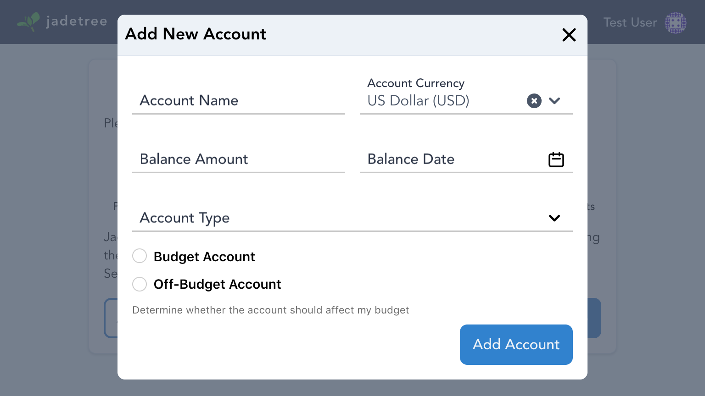

# First Log In

The first time you log in to Jade Tree, you will be prompted to set up your user
profile settings, create a budget, and optionally set up accounts.

## Profile Setup

The first step will set up your profile and localization settings, including
preferred language, currency, and number formatting. The profile setup screen
will look like the following screenshot:

Select your preferred formatting locale and currency and press `Next Step` to
move on to budget setup. The appearance of numbers and dates may be previewed
before finalizing the selection.

:::tip
Currently Jade Tree only supports the English language; however, numbers and
dates may be formatted according to most global locales.
:::

:::danger
The preferred currency is used to report user net worth and other metrics that
do not belong to a single account or budget. It cannot be changed later.
:::

## Budget Setup

The second step is to create a budget. The budget setup screen will look like
the following screenshot:

Enter a name for the new budget and click `Next Step` to move on to account
setup. The budget currency is currently required to be the same as your user
preferred currency.

:::danger
The budget currency is used for all budget entries and spending calculations,
and cannot be changed later.
:::

## Account Setup

The final step is to create accounts. This step may be skipped and accounts can
be added at any time. The account setup screen will look like the following
screenshot:

To add accounts, click the `Add Account` button to show the Add Account dialog,
which looks like the following screenshot:

Enter the Account Name, Balance Amount and Date, and select an Account Type.

:::tip
Liability type account balances should be entered so that positive numbers
correspond to money owed (such as purchases on a credit card that have not been
paid off yet) are positive and credits (such as an overpayment) are negative.
Typically this means all account types will have positive balances. For (much)
more information about how Jade Tree does accounting, see the
[Accounting Theory](/ref/accounting.html) page.
:::

:::tip
Off Budget Accounts may be added to Jade Tree to track investments and other
accounts that are not budgeted. Transactions added to Off Budget accounts may
not be categorized and will not show up as budgetable income or expenses.
:::

More than one account may be added at this point, and the account setup screen
may look similar to the following screenshot:

When finished adding accounts, press `Complete Setup` to complete your user
setup and enter Jade Tree.
